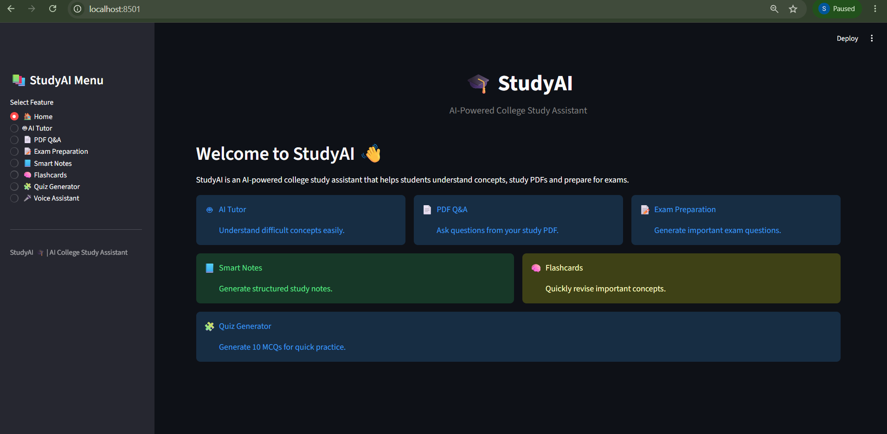
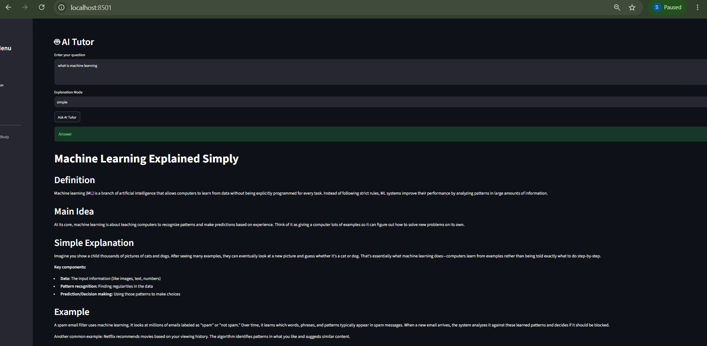
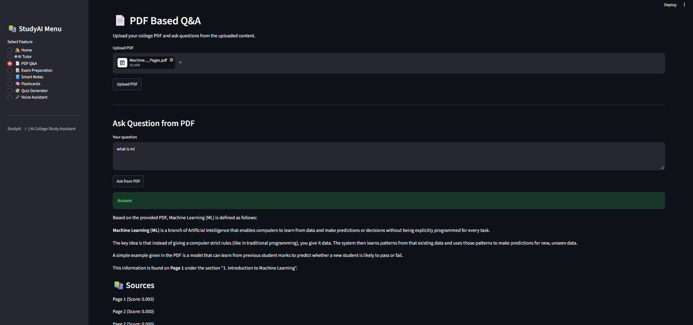
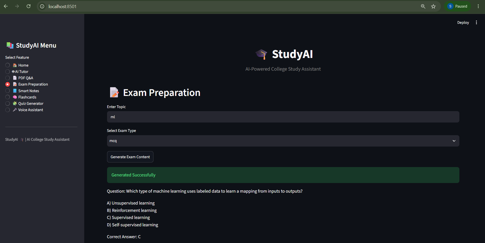
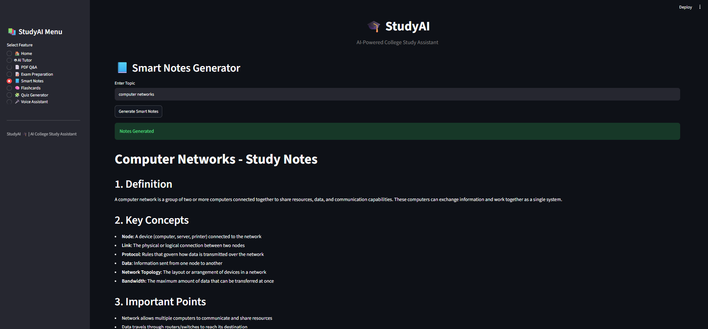
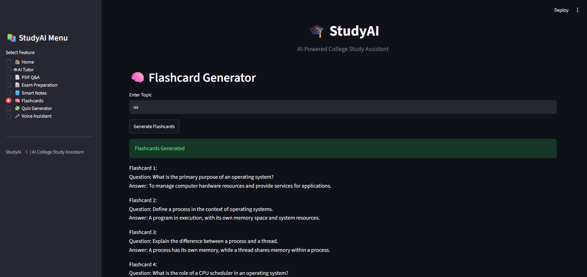
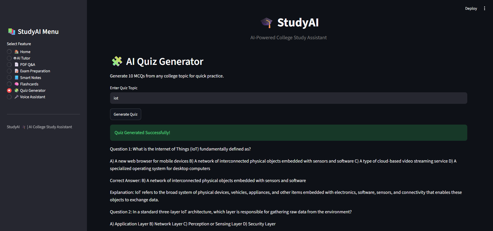
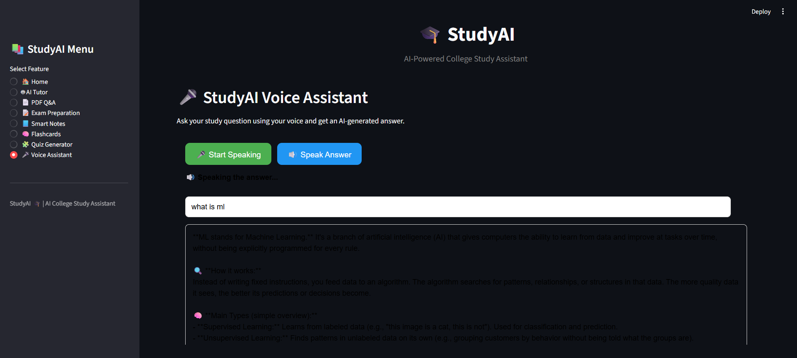

# 🤖 StudyAI Agent

StudyAI Agent is an AI-powered college study assistant designed to help students learn, revise, and prepare for examinations.

## ✨ Features

- 🤖 **AI Tutor** – Get simple explanations for academic topics.
- 📄 **PDF Q&A** – Upload a PDF and ask questions based on its content.
- 📝 **Exam Preparation** – Generate important questions and MCQs.
- 📘 **Smart Notes** – Generate short and organized study notes.
- 🧠 **Flashcards** – Create flashcards for quick revision.
- 🧩 **Quiz Generator** – Generate multiple-choice quizzes with answers and explanations.
- 🎤 **Voice Assistant** – Ask questions using voice and receive spoken responses.

## 🛠️ Technologies Used

### Frontend
- Python
- Streamlit
- HTML
- CSS
- JavaScript
- Web Speech API

### Backend
- Python
- Flask
- Flask-CORS

### AI
- OpenRouter API
- AI Language Model

### PDF & RAG
- PyPDF
- Scikit-learn
- TF-IDF
- Cosine Similarity
- Retrieval-Augmented Generation (RAG)

## 🏗️ Project Structure
## 📸 Screenshots

### 🏠 Home

### 🤖 AI Tutor

### 📄 PDF Q&A

### 📝 Exam Preparation

### 📘 Smart Notes

### 🧠 Flashcards

### 🧩 Quiz Generator

### 🎤 Voice Assistant

StudyAI-Agent/
│
├── backend/
│   ├── app.py
│   ├── ai_engine.py
│   ├── rag_engine.py
│   ├── pdf_processor.py
│   └── test files
│
├── frontend/
│   └── app.py
│
├── uploads/
│
├── .env
├── .gitignore
├── requirements.txt
└── README.md
